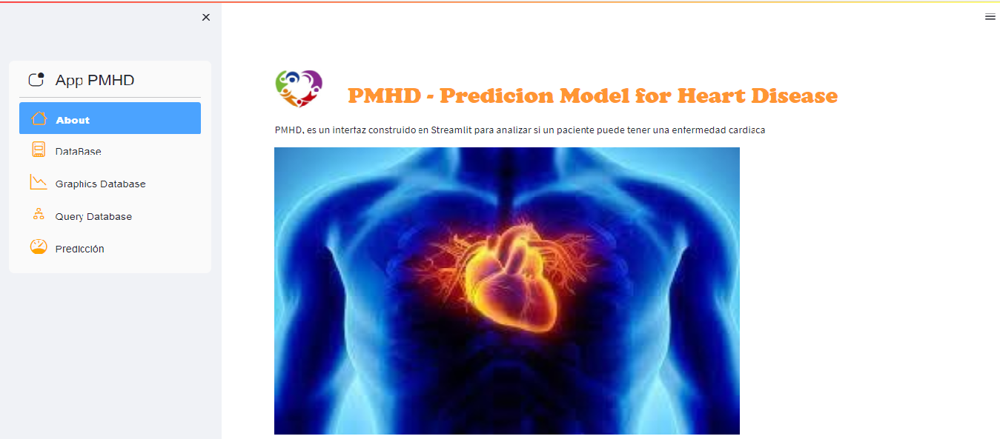
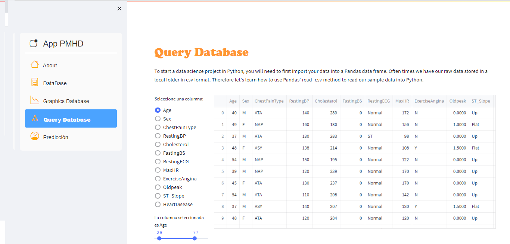

# Heart-Failure

Trabajamos en un proyecto que incluye la creacion de un Dashboard interactivo con Streamlit Framework.[Streamlit Cloud](https://streamlit.io/cloud)

PMHD, es un interfaz construido en Streamlit para analizar si un paciente puede tener una enfermedad cardiaca.

El objetivo, luego de realizar distintos tipos de analisis, es realizar una prediccion acerca de la ocurrencia o no de enfermedades cardíacas. El algoritmo usado para la predicción es el 'Extra Trees Classifier'. Con una precisión del modelo del 90%

Podemos realizar estos análisis con dos aplicaciones para ver gráficamente la información y obtener consultas de la base de datos por diferentes tipos de variables.

Usamos el data de Kaggle "Heart Failure Prediction Dataset" https://www.kaggle.com/datasets/fedesoriano/heart-failure-prediction

Trabajamos con Python 3.8.10

## Source code

Source code: <https://github.com/giswqs/streamlit-XXXXXXXXXXXX>

## Demo

